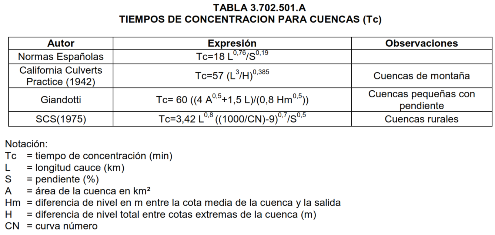

# HU_SCS
Codigo para determinar el hidrograma unitario del SCS

## Fórmulas de Tiempo de Concentración

Las fórmulas correspondientes a **Normas Españolas**, **California Culverts Practice**, **Giandotti** y **Lag SCS** han sido obtenidas desde la Tabla 3.702.501.A (Manual de Carreteras, Volumen 3):

