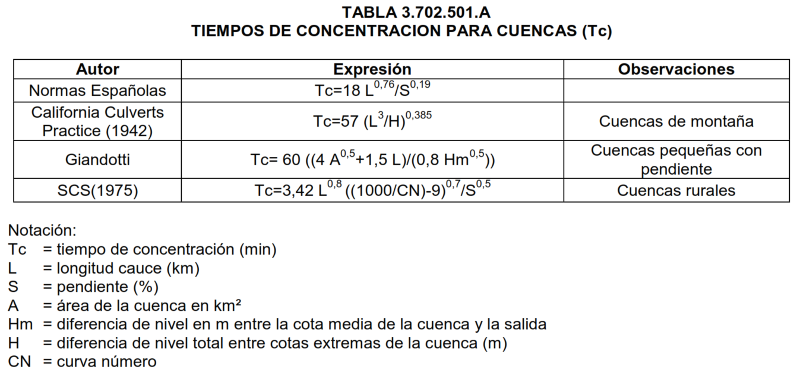

# Hidrograma Unitario SCS

## 1. Descripcion

Este codigo determina el hidrograma unitario del Soil Conservation Service (SCS) para las cuencas definidas por el usuario. El metodo de abstracciones o perdidas se calcula mediante el metodo de la Curva Numero (CN).

El procesamiento se realiza para todas las combinaciones ingresadas en `Inputs.xlsx`:

- Para cada cuenca, se calculan los hidrogramas asociados a todas las precipitaciones maximas y sus respectivos periodos de retorno.
- Para cada cuenca, el codigo considera todos los valores de coeficiente de duracion (CD) ingresados e itera sobre cada duracion de tormenta asociada a esos CD.
- Para cada cuenca, se evalua cada una de las distribuciones temporales de tormenta ingresadas.

De esta forma, se obtiene un hidrograma para cada combinacion de cuenca, periodo de retorno, duracion de tormenta y distribucion temporal definida en los datos de entrada.

## 2. Referencias

- Ministerio de Obras Publicas (MOP), Chile. *Manual de Carreteras, Volumen 3*.
- Natural Resources Conservation Service (NRCS). *National Engineering Handbook, Chapter 16: Hydrographs*.
- Ven Te Chow. *Hidrologia Aplicada*.

## 3. Estructura requerida

El codigo debe ejecutarse desde la carpeta raiz del repositorio y requiere la siguiente estructura:

```text
HU_SCS/
|- HU_SCS.R
|- Inputs/
|  `- Inputs.xlsx
|- Outputs/                 <- creada automaticamente por el codigo
`- images/
```

La carpeta `Inputs` debe existir y contener el archivo `Inputs.xlsx`. La carpeta `Outputs` no es necesaria antes de ejecutar el codigo: se crea automaticamente. Si ya existe, sus resultados previos se eliminan al inicio de una nueva ejecucion.

Los resultados se guardan con la siguiente organizacion:

```text
Outputs/
`- <cuenca>/
	`- <tormenta>/
		|- HED_resultados.xlsx
		`- HED_01.png, HED_02.png, ...
```

Para cada combinacion de cuenca y distribucion de tormenta, `HED_resultados.xlsx` contiene una hoja `Resumen`, con el caudal maximo y volumen por periodo de retorno y duracion, y una hoja `HED_series`, con las series temporales de caudal, precipitacion total y precipitacion efectiva. Se genera ademas un grafico PNG para cada periodo de retorno, con todas las duraciones evaluadas superpuestas.

## 4. Archivo `Inputs.xlsx`

### Pestana `Info Cuencas`

En esta pestana se ingresan los parametros de las cuencas a evaluar:

- ID o nombre de cada cuenca.
- Area de la cuenca en km2.
- Curva Numero (CN).
- Elevaciones minima, maxima, rango y media.
- Pendiente media del cauce principal.
- Longitud del cauce principal.
- Longitud entre el cauce y el centro de gravedad.
- Velocidad media del cauce principal.

Estos parametros se utilizan para calcular los tiempos de concentracion y son obligatorios cuando el metodo de calculo seleccionado los requiera. La longitud entre el cauce y el centro de gravedad no es necesario rellenarla.

El codigo calcula unicamente los tiempos de concentracion indicados en la Tabla 3.702.501.A del *Manual de Carreteras, Volumen 3* del Ministerio de Obras Publicas de Chile: Normas Espanolas, California Culverts Practice, Giandotti y SCS.



La ultima celda, **Tiempo de Concentracion Adoptado (hr)**, debe ser completada obligatoriamente para cada cuenca. El codigo se detendra si alguna cuenca no tiene este valor ingresado.

El valor adoptado queda a criterio del usuario: puede ser el promedio de todos los metodos calculados, el promedio de algunos de ellos, un valor particular de un metodo o cualquier otro valor tecnicamente justificado. Solo debe cumplir estas condiciones:

- Debe ser mayor o igual a 10 minutos (aproximadamente 0.167 hr).
- Debe ingresarse en horas.